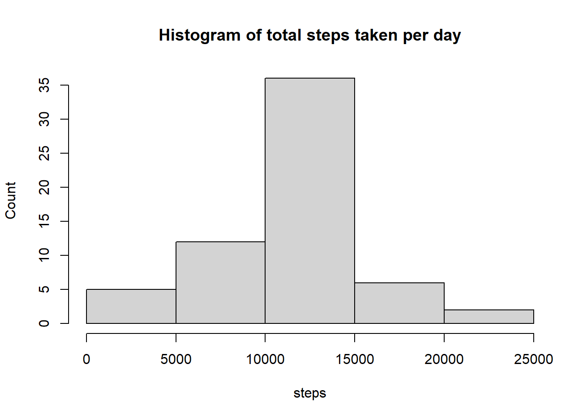

## Loading and preprocessing the data

In this code chunk, I have downloaded the data from the [provided link](https://d396qusza40orc.cloudfront.net/repdata%2Fdata%2Factivity.zip), unzipped it and loaded it into R as a dataframe.


```r
## Create directory where extracted data will be stored
if(!file.exists("./data")){dir.create("./data")}

filename <- "https://d396qusza40orc.cloudfront.net/repdata%2Fdata%2Factivity.zip"
download.file(filename, destfile = "repdata%2Fdata%2Factivity.zip")

unzip("repdata%2Fdata%2Factivity.zip", exdir="./data")
df <- read.csv("./data/activity.csv", header = TRUE)
```

After evaluating the dataframe df, I convert the variable date from a character type to a Date type.


```r
df$date <- as.Date(df$date)
```

## What is mean total number of steps taken per day?
1. Calculate the total number of steps taken per day using dplyr library
2. Plot a histogram
3. Calculate the mean and median total number of steps taken per day


```r
library(dplyr)
total_steps <- aggregate(data = df, steps ~ date, sum, na.rm = TRUE)
hist(total_steps$steps, main = "Histogram of total steps taken per day", 
     xlab = "steps", ylab = "Count")
```


```r
meansteps <- mean(total_steps$steps, na.rm = TRUE)
mediansteps <- median(total_steps$steps, na.rm = TRUE)
```
### The mean number of steps taken each day is 1.0766189\times 10^{4} and the median is 10765.

## What is the average daily activity pattern?
1. Aggregate the data in terms of the intervals using dplyr library
2. Calculate the average steps taken for each aggregated interval using mean and omitting NA values
3. Plot line graph of average steps (y-axis) per interval (x-axis)


```r
mean_interval <- aggregate(data = df, steps ~ interval, mean, na.rm = TRUE)
plot(mean_interval$interval, mean_interval$steps, 
     type = "l", main = "Average daily activity pattern", 
     xlab = "Interval numbers", ylab = "Average number of steps", 
     col = "blue", lwd = 2)
```


1. Find the row containing the maximum average number of steps using the which.max function
2. Using the row number, identify the interval


```r
max_interval <- mean_interval[which.max(mean_interval$steps),]
```
### The interval with the daily maximum number of steps is 835.

## Imputing Missing Values
1. Calculate the number of rows that contain NA

```r
total_NA <- sum(is.na(df$steps))
```
### There are 2304 rows containing NA values in our dataframe.

To impute the missing values, we will replace the NA values using the already calculated mean values for each interval stored in the mean_interval dataframe. We will do so by:

1. Create a new dataframe called noNAdf
2. Run a for loop through all rows of noNAdf where if the steps variable contains an NA, the interval will be matched to the interval of the mean_interval dataframe.
3. The steps variable of the mean_interval dataframe will replace the NA value.


```r
noNAdf <- df
for (i in 1:nrow(noNAdf)) {
        if (is.na(noNAdf$steps[i]) == TRUE) {
                noNAdf$steps[i] <- mean_interval$steps[mean_interval$interval == noNAdf$interval[i]]
        }
        
        i <- i+1
}
```

1. Make a histogram of the total number of steps taken each day using the new dataframe with no NA values.
2. Calculate and report the mean and median total number of steps taken per day. 


```r
noNAtotal_steps <- aggregate(data = noNAdf, steps ~ date, sum, na.rm = TRUE)
hist(noNAtotal_steps$steps, main = "Histogram of total steps taken per day", 
     xlab = "steps", ylab = "Count")
```



```r
noNAmeansteps <- mean(noNAtotal_steps$steps, na.rm = TRUE)
noNAmediansteps <- median(noNAtotal_steps$steps, na.rm = TRUE)
```
### The mean number of steps taken each day is 1.0766189\times 10^{4} and the median is 1.0766189\times 10^{4}.

We observe that the mean remains unchanged when imputing the NA values from our dataframe whereas the median slightly changes. The impact of imputing the data is overall negligible, probably because the NA data is distributed across full days essentially removing 8 full days from the measurement.

## Are there differences in activity patterns between weekdays and weekends?
1. Create a factor variable that will separate the days into weekend or weekday. This is achieved using the weekdays() function. If the output matches "Saturday" or "Sunday", then the day is labeled as a "weekend"


```r
for (i in 1:nrow(noNAdf)) {
        if ((weekdays(noNAdf$date[i]) == "Saturday") | (weekdays(noNAdf$date[i]) == "Sunday"))  {
                noNAdf$day[i] <- "weekend"
        } else {noNAdf$day[i] <- "weekday"}
        
        i <- i+1
}
```

2. Aggregate the data in terms of the intervals using dplyr library
3. Calculate the average steps taken for each aggregated interval as a function of day using mean.
4. Plot line graph of average steps (y-axis) per interval (x-axis) as a function of day using ggplot.


```r
library(ggplot2)
mean_interval <- aggregate(data = noNAdf, steps ~ interval + day, mean, na.rm = TRUE)
ggplot(data = mean_interval, aes(x = interval, y = steps)) + geom_line() + facet_grid(day~.) +
        ggtitle("Average number of steps on weekdays and weekends")
```


